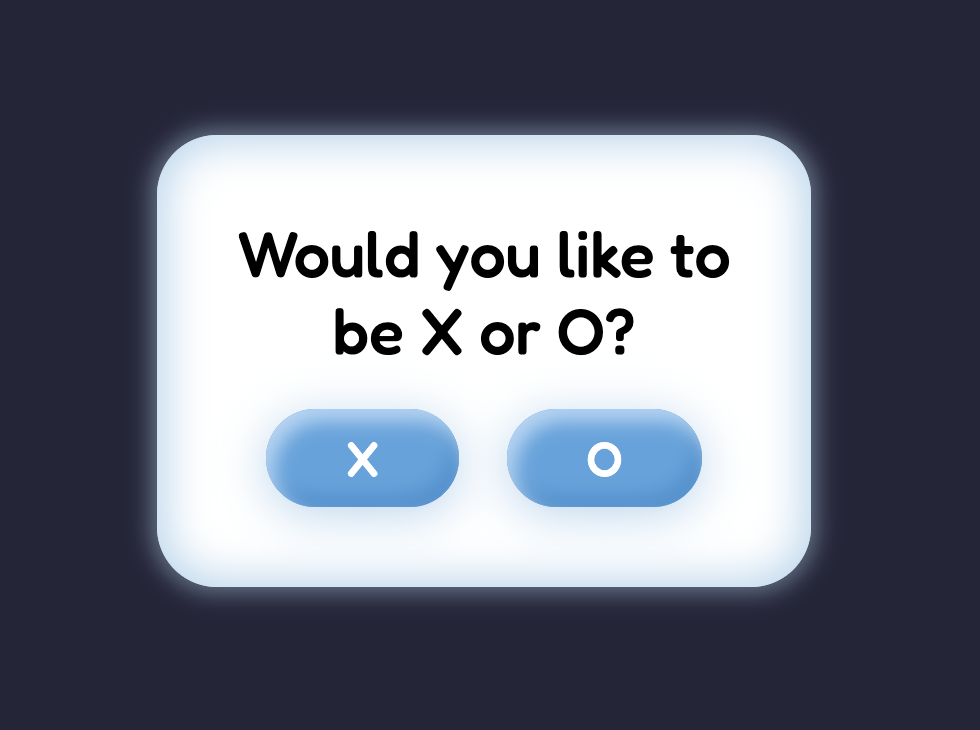
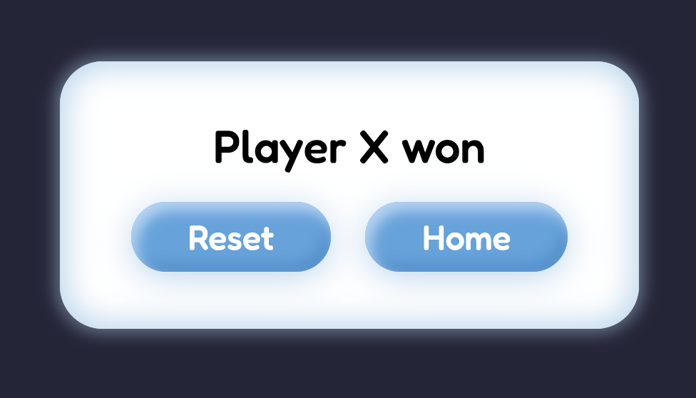

# Tic Tac Toe

This is a solution to the [Build a Tic Tac Toe Game](https://www.freecodecamp.org/learn/coding-interview-prep/take-home-projects/build-a-tic-tac-toe-game) from [FreeCodeCamp](https://www.freecodecamp.org/). FreeCodeCamp is a non-profit organization that consists of an interactive learning web platform, an online community forum, chat rooms, online publications and local organizations that intend to make learning web development accessible to anyone. 

## Table of contents

- [Overview](#overview)
  - [The challenge](#the-challenge)
  - [Screenshot](#screenshot)
  - [Links](#links)
- [My process](#my-process)
  - [Built with](#built-with)
- [Author](#author)

## Overview

### The challenge

Users should be able to:

- View the optimal layout for the site depending on their device's screen size
- See hover states for all interactive elements on the page
- Play a game of Tic Tac Toe with another person using the computer
- Play the reset game again
- Choose whether they want to play as X or O

### Screenshot

### Links

- Solution URL: [https://github.com/Krrish105/tic-tac-toe](https://github.com/tic-tac-toe)
- Live Site URL: [https://krrish105.github.io/tic-tac-toe/](https://krrish105.github.io/tic-tac-toe/)

## My process

### Built with

- Semantic HTML5 markup
- CSS custom properties
- CSS Grid
- Mobile-first workflow
- JQuery

## Author

- Frontend Mentor - [Krrish105](https://www.frontendmentor.io/profile/Krrish105)
- Twitter - [_karishma10](https://twitter.com/_karishma10)
- LinkedIn - [Karishma Garg](https://www.linkedin.com/in/karishma-garg-)
- Codepen - [Krrish105](https://codepen.io/krrish105)
